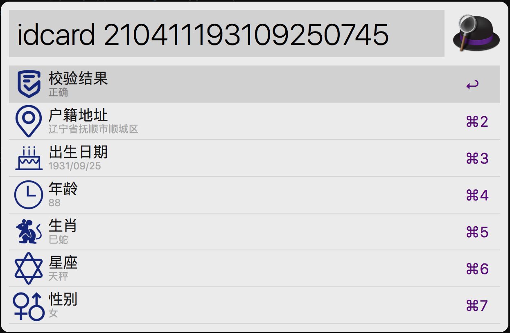

Idcard Workflow for [Alfred 4](http://www.alfredapp.com)
==============================

可以通过输入命令：idcard，完成以下功能：
* 身份证号随机生成
* 身份证号校验
* 身份证号信息提取

**[下载地址](https://github.com/mumubusu/idcard-alfred-workflow/releases)**

Contribution

@ailbs
